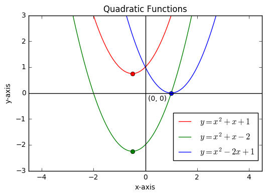

# Jupyter Notebook ব্যবহার
-- আলমগীর হোসেন 

আপনি কি <a href="http://jupyter.org/">Jupyter</a> নোটবুক ব্যবহারে আগ্রহী? <a href="http://jupyter.org/">Jupyter</a> নোটবুক একটি ওয়েব অ্যাপ্লিকেশন যা দিয়ে আপনি প্রোগ্রামিং কোড, গাণিতিক সমীকরণ, ফিগার এবং ব্যাখ্যামূলক টেক্সট লিখতে পারবেন। এটি ব্যবহার করে ডেটা বিশ্লেষণ, নিউমারিক্যাল সিমুলেশন, পরিসংখ্যানগত মডেলিং, মেশিন লার্নিং এবং আরো অনেক কিছু করতে পারবেন। এটিতে জনপ্রিয় প্রোগ্রামিং Python, Matlab , R, Julia সহ  প্রায়  40 টিরও বেশি প্রোগ্রামিং ভাষা  ব্যবহার করতে পারবেন। এছাড়া Jupyter দিয়ে খুব সহজে কোনো ডকুমেন্ট বা প্রেজেন্টেশন স্লাইড তৈরী করে ফেলতে পারেন;  যেখানে কোড, সমীকরণ, ফটো এবং টেক্সট লিখতে পারেন। আপনার কম্পিউটারে যদি Jupyter Notebook ইনস্টল করা না থাকে তাহলে <a href="https://juliabox.com/"> JuliaBox</a> ব্যবহার করে (লবন টেস্ট) দেখতে পারেন। আপনার গুগল, গিটহাব কিংবা লিংকডইন একাউন্ট থেকে <a href="https://juliabox.com/"> JuliaBox</a> এ লগইন করুন। 


এই Julia কোনো মেয়ের নাম না! এটি একটি প্রোগ্রামিং ল্যাঙ্গুয়েজ। <a href="https://juliabox.com/"> JuliaBox</a> এ লগইন করার পর কিছু Jupyter নোটবুক এ লেখা টিউটোরিয়া দেখতে পাবেন সেগুলো নাড়া-ছাড়া দিয়ে দেখতে পারেন। Jupyter এ python ও Julia kernel রয়েছে। এর যেকোনো ব্যবহার করে আপনার নতুন একটি Jupyter Notebook ফাইল তৈরী করতে পারেন।  নতুন Jupyter এ আপনি একটি Code বক্স পাবেন। আপনি Julia কিংবা python না জানলেও কোনো সমস্যা নাই. যোগ, বিয়োগ, গুন ভাগ করে ফেলুন। যেমন, 5+10 লিখে SHIFT+ENTER একসাথে চাপুন। অথবা (<button class='btn fa-step-forward fa btn-default'></button>) এই বাটনটি চাপুন। দেখুন Jupyter কিভাবে ক্যালকুলেটরের কাজ করছে। 


```python
5+10 # Press Shift + Enter
```


    15


```python
60.0/11.0
```


    5.454545454545454


যদি আপনার নোটবুকে kernel অপশনে Julia থাকে তাহলে সাইন্টিফিক ক্যালকুলেটরের সব কাজ সেরে ফেলতে পারেন। যেমন, 


```python
pi
```


    π = 3.1415926535897...


```python
sin(pi/4)
```


    0.7071067811865475


আর যদি kernel অপশন Python থাকে তাহলে একটু কায়দা করে সাইন্টিফিক ক্যালকুলেটরের কাজ করতে হবে। যেমন, math.sin(4) কিংবা math.pi লিখে SHIFT+ENTER চাপলে sin(4) কিংবা pi এর মান পেয়ে যাবেন।


```python
import math
math.pi
```


    3.141592653589793


```python
math.sin(4)
```


    -0.7568024953079282


চাইলে বক্সের Code অপশন পরিবর্তন করে <a href='https://github.com/adam-p/markdown-here/wiki/Markdown-Cheatsheet'> Markdown</a> অপশনে যেতে পারেন। Markdown অপশনে যাবার পর বক্সটিতে লিখে ফেলুন 

```# Hello World```

এরপর SHIFT+ENTER চাপুন। তৈরী হয়ে গেলো Jupyter এ আপনার লেখা প্রথম হেডিং!

এরপরের বক্সটিতেও Markdown অপশন দিতে পারেন। এরপর লিখতে পারেন

```LaTeX
$y = ax^2+bx+c$
```

এরপর SHIFT+ENTER চাপুন। আপনি সমীকরণটি 
$y = ax^2+bx+c$
দেখতে পাবেন। হ্যা আপনি  Jupyter এ LaTeX লেখা শুরু করে ফেলেছেন! এছাড়া লিংকটি দেখে আরো কিছু গাণিতিক সমীকরণ, টেবিল তৈরী, বুলেট পয়েন্ট, কিছু paithon কোড দেখতে পাবেন সেগুলো অনুশীলন করে দেখতে পারেন।
- [অনুশীলন লিংক](http://nbviewer.jupyter.org/github/alamgirh/alamgirh.github.io/blob/master/blog/LectureNotes-jupyter.ipynb)

এছাড়া আপনি টুকটাক প্রোগ্রামিং কাজ সেরে ফেলতে পারেন। নিচে আমি বিভিন্ন কোয়াড্রেটিক ফাংশনের গ্রাফ কিভাবে আঁকতে হবে, python এ তার একটা উদাহরণ দিলাম। আপনি আমার এটি ব্যবহার করতে পারেন অথবা নতুন কোনো প্রোগ্রাম লিখতে পারেন।  


```python
import matplotlib.pyplot as plt
import numpy as np

x = np.linspace(-3, 3, 100)

def f(x,a,b,c):
   return a*x**2+b*x+c;

def vertex(a,b,c):
   x0 = -b/(2.0*a)
   y0 = c-b*b/(4.0*a)
   return [x0, y0];

plt.plot(x, f(x,1,1,1), label='$y=x^{2}+x+1$',color='red')
plt.plot(x, f(x,1,1,-2), label='$y=x^{2}+x-2$',color='green')
plt.plot(x, f(x,1,-2,1), label='$y=x^{2}-2x+1$',color='blue')
a1, b1 = vertex(1,1,1)
plt.plot([a1],[b1], 'ro')
a2, b2 = vertex(1,1,-2)
plt.plot([a2],[b2], 'go')
a3, b3 = vertex(1,-2,1)
plt.plot([a3],[b3], 'bo')

plt.axis('equal')
plt.xlabel('x-axis')
plt.ylabel('y-axis')
plt.axhline(0, color='black')
plt.axvline(0, color='black')
plt.title("Quadratic Functions")
plt.annotate('(0, 0)', xy=(0, 0), xytext=(.1, -.3))
plt.axis([-3, 3, -3, 3])
plt.legend(bbox_to_anchor=(1, .4))
plt.show()
```





- জুপিটার নিয়ে নেচার জার্নালে প্রকাশিত একটি লেখা 
 - http://www.nature.com/news/ipython-interactive-demo-7.21492?article=1.16261
- নেচার জার্নালের এই লিঙ্কে আপনি চাইলে জুপিটার নোটবুক ব্যবহার করে দেখতে পারেন।
 - http://www.nature.com/news/ipython-interactive-demo-7.21492
- [অনুশীলন লিংক](http://nbviewer.jupyter.org/github/alamgirh/alamgirh.github.io/blob/master/blog/LectureNotes-jupyter.ipynb)
